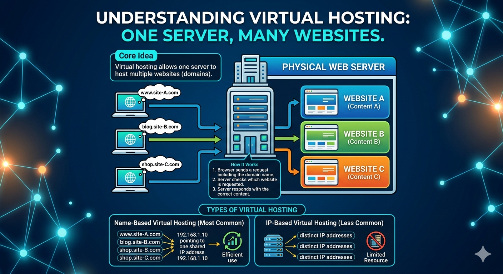
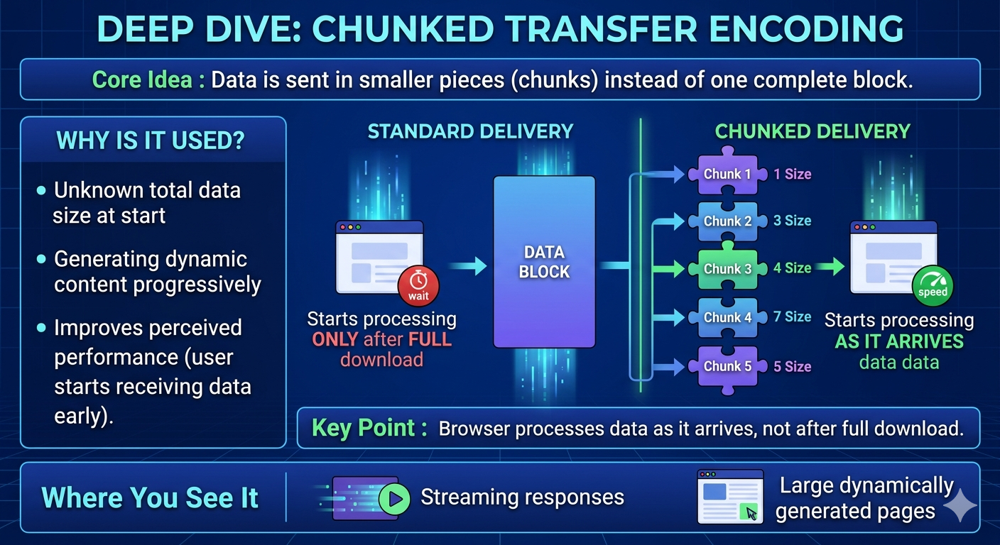
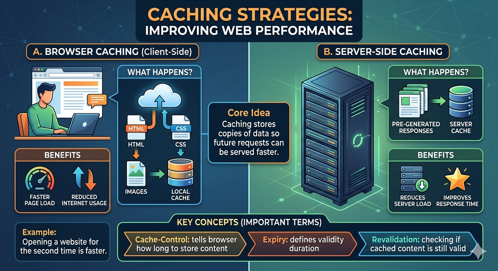
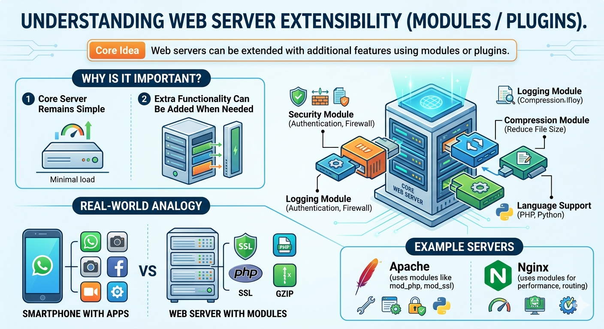

# 🛠️ Instructor’s Note on AI & Ethics

**Content Origin:** This lecture material was drafted with the assistance of Google AI Studio and has been carefully reviewed and edited by the instructor to ensure technical accuracy and alignment with course goals.

**A Word of Caution:** In the field of Web Technologies, AI is a powerful productivity tool—but it is not a substitute for foundational knowledge.

**Ethics & Accountability:**
You are encouraged to use AI to:
- Clarify concepts
- Debug code

However, you are **fully responsible** for anything you submit. Copying AI-generated material without understanding it is a violation of academic integrity and prevents the development of critical thinking skills required for real-world systems.

> ✅ Always verify — never just copy.

---
# Lecture 4: Web Server Advanced Concepts

## Learning Objectives
By the end of this lecture, students will be able to:
* **Explain** how a single web server can host multiple websites (Virtual Hosting).
* **Understand** how data can be sent in parts using Chunked Transfer Encoding.
* **Describe** how caching improves web performance at both browser and server levels.
* **Recognize** how web servers can be extended using modules and plugins.

---

## 1. Recap of Previous Lecture
* Web follows a **Client–Server model**.
* Requests and responses are exchanged using **HTTP**.
* Content can be **static** (fixed files) or **dynamic** (generated on-the-fly).

---

## 2. Virtual Hosting
Virtual hosting allows one physical server to host multiple websites (domains).

### Core Concepts
* **Why?** Cost efficiency and better resource utilization.
* **How it works:** The browser sends the domain name (e.g., www.example.com) in the request header, and the server directs it to the correct internal folder.

### Types of Virtual Hosting
1.  **Name-Based:** Multiple domains share one IP address. (Most common).
2.  **IP-Based:** Each website has a unique IP address.

### Visual Guide: Virtual Hosting

---

## 3. Chunked Transfer Encoding
Data is sent in smaller "chunks" instead of one massive block.

### Core Concepts
* **Why?** Used when total size is unknown or for dynamic streaming.
* **The Benefit:** Improved perceived performance; the browser starts rendering as soon as the first chunk arrives.

### Real-World Analogy
Like a multi-course meal: You receive the soup first, then the main, then dessert. You don't wait for the whole kitchen to finish before you start eating.

### Visual Guide: Chunked Transfer

---

## 4. Caching (Browser + Server)
Caching stores copies of data so future requests can be served significantly faster.

### A. Browser Caching (Client-Side)
* Files (HTML/CSS/Images) are stored on the user's computer.
* **Result:** Revisiting a site is much faster and saves data.

### B. Server-Side Caching
* The server saves pre-generated responses.
* **Result:** Reduces CPU load on the server for popular requests.

### Key Terms
* **Cache-Control:** Instructions on how/when to cache.
* **Expiry:** How long the data remains valid.
* **Revalidation:** Checking if the cached version is still the latest.

### Visual Guide: Caching Strategies

---

## 5. Extensibility (Modules / Plugins)
Web servers can be extended with additional features without changing the core software.

### Examples of Modules
* **Security:** Firewalls and authentication.
* **Compression:** Gzip/Brotli to reduce file size.
* **Language Support:** PHP, Python, or Ruby integration.

### Visual Guide: Server Extensibility

---

## 6. Practice & Application

### Conceptual Questions
1. Why is virtual hosting essential for modern cloud hosting providers?
2. In what scenario would "Chunked Encoding" be better than sending a single file?
3. What is the difference between an 'Expired' cache and a 'Revalidated' cache?

### Application Exercises
* **Identify:** When you refresh a news site and it loads instantly without the loading bar moving, is that Browser or Server caching?
* **Analogy:** Find another real-life example of "Extensibility" (e.g., Power tools with different attachments).

---

## 7. Summary
* **Virtual Hosting:** One server, many sites.
* **Chunked Encoding:** Piece-by-piece delivery.
* **Caching:** Store it locally to save time.
* **Extensibility:** Add features via modules.
